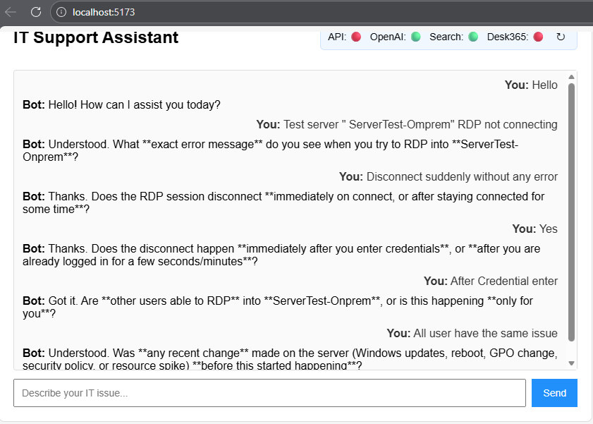
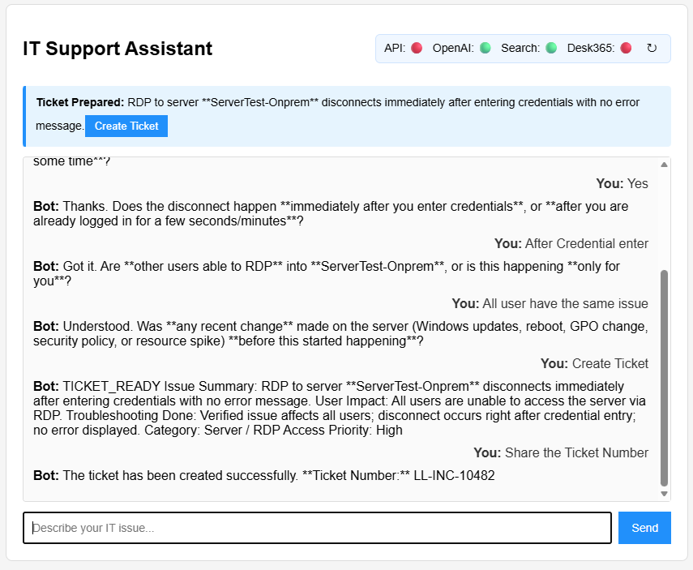
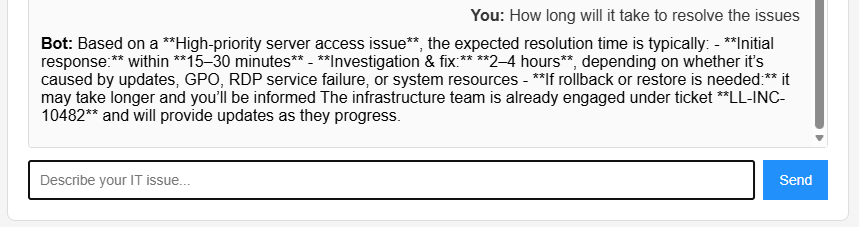

🛠️ IT Support Chat Bot – Azure OpenAI + Freshdesk
An intelligent IT Support Assistant powered by Azure OpenAI, Azure Cognitive Search, and Freshdesk.
Designed for enterprise IT teams to automate troubleshooting, streamline ticket creation, and deliver fast, accurate support.

## 🚀 Features
- 💬 Conversational AI using Azure OpenAI
- 🔍 Knowledge-aware responses via Azure Cognitive Search
- 🎫 Freshdesk ticket creation with auto‑assignment
- 🧠 Automatic category & priority detection
- 📊 Ticket dashboard API for recent tickets
- 🖼️ Frontend ticket banner with live status + link
- 🛡️ Centralized error logging
- 🧩 Modular backend architecture for easy scaling

## 🧱 Tech Stack

| Layer       | Technology                          |
|-------------|--------------------------------------|
| Frontend    | React + Vite                         |
| Backend     | Node.js + Express                    |
| AI Engine   | Azure OpenAI GPT‑5.2                 |
| Search      | Azure Cognitive Search               |
| Ticketing   | Freshdesk REST API                   |
| Tools       | Axios, Nodemon, dotenv               |

## 📂 Project Structure
IT_Chat-support-Openai-Bot/
├── backend/
│   ├── routes/
│   │   ├── chat.js
│   │   └── tickets.js
│   ├── services/
│   │   ├── freshdeskClient.js
│   │   ├── errorLogger.js
│   │   └── autoCategorizer.js
│   ├── logs/
│   └── server.js
├── frontend/
│   ├── src/
│   │   ├── components/
│   │   │   ├── TicketBanner.jsx
│   │   │   └── TicketBanner.css
│   │   └── App.jsx
│   └── index.html
├── .gitignore
├── README.md
└── .env  (not committed)

## ⚙️ Setup Instructions
1. Clone the repository
git clone https://github.com/leoraj/IT_Chat-support-Openai-Bot.git
cd IT_Chat-support-Openai-Bot

## 🖥️ Backend Setup
cd backend
npm install
npm run dev

Create a .env file inside backend/:
PORT=5000

AZURE_OPENAI_ENDPOINT=your-endpoint
AZURE_OPENAI_DEPLOYMENT=your-deployment
AZURE_OPENAI_API_VERSION=your-version
AZURE_OPENAI_KEY=your-key

AZURE_SEARCH_ENDPOINT=your-search-endpoint
AZURE_SEARCH_INDEX=your-index
AZURE_SEARCH_API_VERSION=your-version
AZURE_SEARCH_KEY=your-key

FRESHDESK_DOMAIN=yourdomain.freshdesk.com
FRESHDESK_API_KEY=your-api-key
FRESHDESK_DEFAULT_GROUP_ID=123456789
FRESHDESK_DEFAULT_AGENT_ID=987654321

## 🌐 Frontend Setup
cd ../frontend
npm install
npm run dev

The app will start on Vite’s default port (usually 5173).

## 📡 API Endpoints
POST /chat
Handles AI conversation + Azure Search context.
POST /chat/ticket
Creates a Freshdesk ticket with:
- Issue summary
- Conversation history
- Auto category
- Auto priority
GET /api/tickets/recent
Returns recent Freshdesk tickets for dashboard view.

## 🧠 IT Support Portal AI – UI Screenshots

### 📬 Mail GUI

### 📝 Ticket Creation

### 🚨 Auto Set Severity

👨‍💻 Author
RajKumar Santhanam

